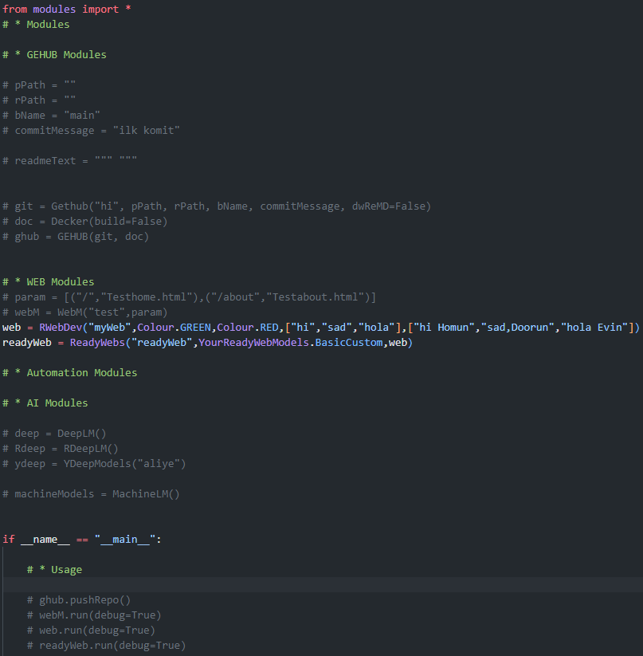
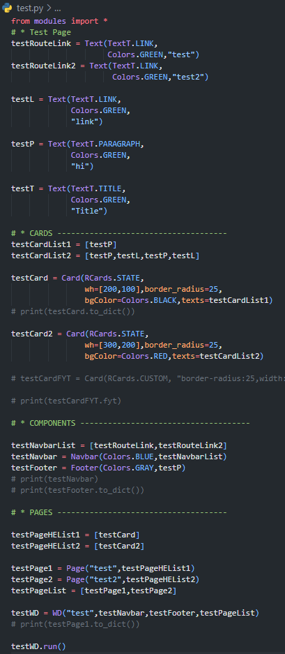

# Project : **Modules**

Tüm modüllerin olduğu bir modül :D

hala geliştirilme aşamasında eksik ve çalışmayan kısımlar var. 

NOT : Docker çalışmıyor.

## Contents
1. Kişisel variable
2. Constant yapısı
3. Hazır/hızlı web build
4. Dart benzeri web build
5. Githuba kolay&&hızlı yolla repo gönderme.
6. Çeşitli yenilik ve kolaylık sunan modüller

Genel ekran fotosu: 



Dartpy :



## Nasıl Çalıştırılır

1. Install the required Node.js dependencies:
  ```bash
  npm install
  ```

2. Activating the virtual env:
  ```bash
  python -m venv .venv
  pip install -r requirements.txt
  ```

3. And run this command for the start/test:
  ```bash
  cd src
  python __main__.py
  ```

